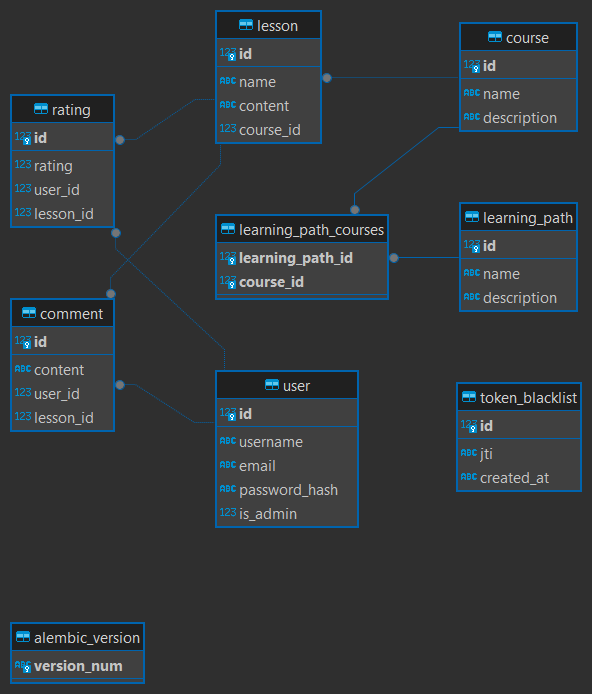

# ProjetoFlask
Projeto feito para o processo seletivo da V4Company, projeto de um E-learning API com JWT.
Para rodar o projeto, é necessário colocar uma JWT_SECRET_KEY no .env e ao criar o um usuário é necessário colocar a flag "is_admin": true, para conseguir testar as chamadas de criar de deletar.

## imagem do database

